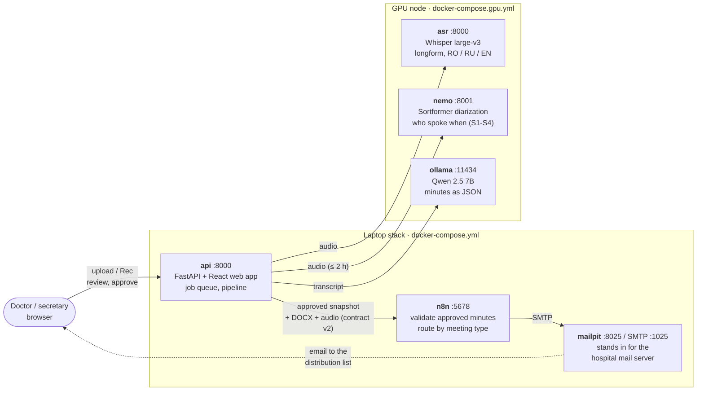
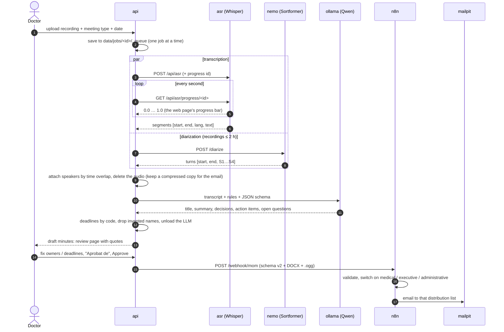
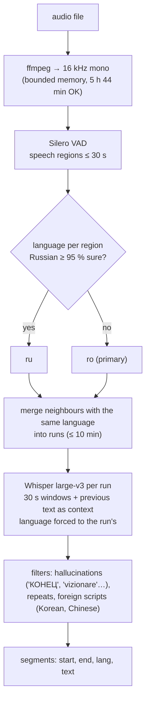
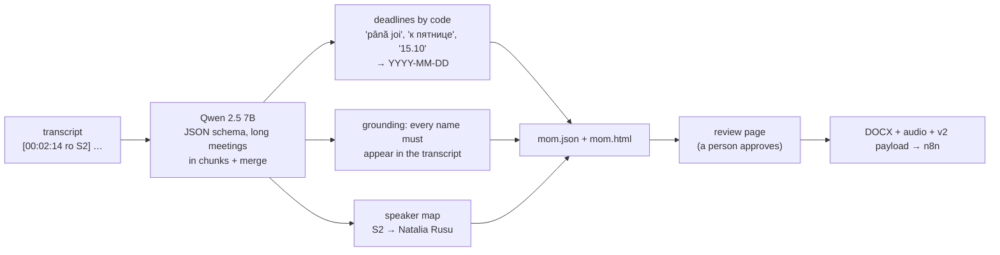
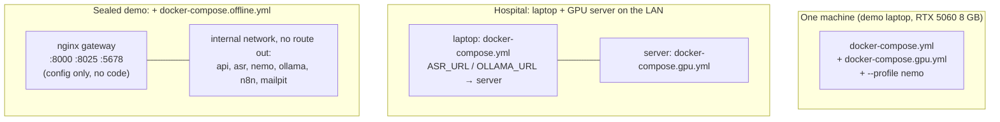

# Architecture

Everything runs on the hospital network. No component calls a cloud service at runtime.
Model weights are downloaded once during setup and then load from disk (`OFFLINE=1`).

## 1. The stack at a glance

For the demo, both compose files run on **one laptop** as one project. In a hospital, the
GPU node would be the server-room machine and the laptop stack would run anywhere on the LAN.

## 2. One meeting, start to finish

## 3. Inside the ASR: longform with language runs

Why this design, measured on a hand-corrected Moldovan lecture and the Parliament session:

| Choice | Instead of | Result |
|---|---|---|
| 30 s windows with context | short chunks (5-20 s) | WER 53 % vs 78-85 % |
| language chosen **before** decoding | re-checking after | whole Russian speeches kept (Whisper forced to Romanian writes "Să vă mulțumim pentru vizionare" instead) |
| Russian only at ≥ 95 % | 80 % | no fake Russian on noisy Romanian (66.5 % → 53 % WER) |
| Whisper large-v3 | large-v3-turbo / Nemotron 3.5 | 53 % vs 57-71 % (turbo); 5/5 vs 2/5 phrases (Nemotron) |

## 4. From transcript to minutes

The LLM only reads and summarises. Dates, names and the delivery format are checked by
plain code, so a 7B model can't invent an owner or miscount a weekday.

## 5. Deployment modes

`scripts/egress-check.sh` opens a connection to the internet from inside every container;
in sealed mode each one must print **BLOCKED**. `scripts/gpu-check.sh` confirms the models
run on the GPU.

## 6. Where things live

| What | Where | Kept? |
|---|---|---|
| uploaded audio | `data/jobs/<id>/audio.*` | deleted right after transcription (`KEEP_AUDIO=0`) |
| transcript, speakers | `data/jobs/<id>/segments.json`, `transcript.txt` | on the server only, never emailed |
| draft / approved minutes | `data/jobs/<id>/mom_draft.json`, `mom.json`, `mom.html` | on the server |
| model weights | `models/whisper`, `models/ollama`, `models/hf` | local disk |
| routing workflow + SMTP credential | `n8n/workflows`, `n8n/credentials` | imported by `n8n-init` at start |

`data/` and `models/` are git-ignored. Interfaces between the services: [contracts.md](contracts.md).
